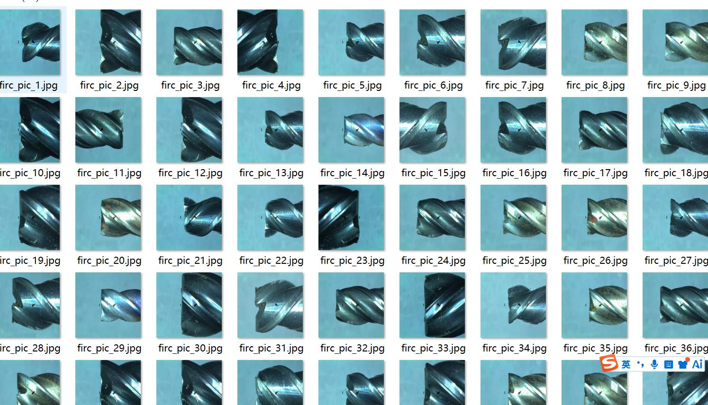
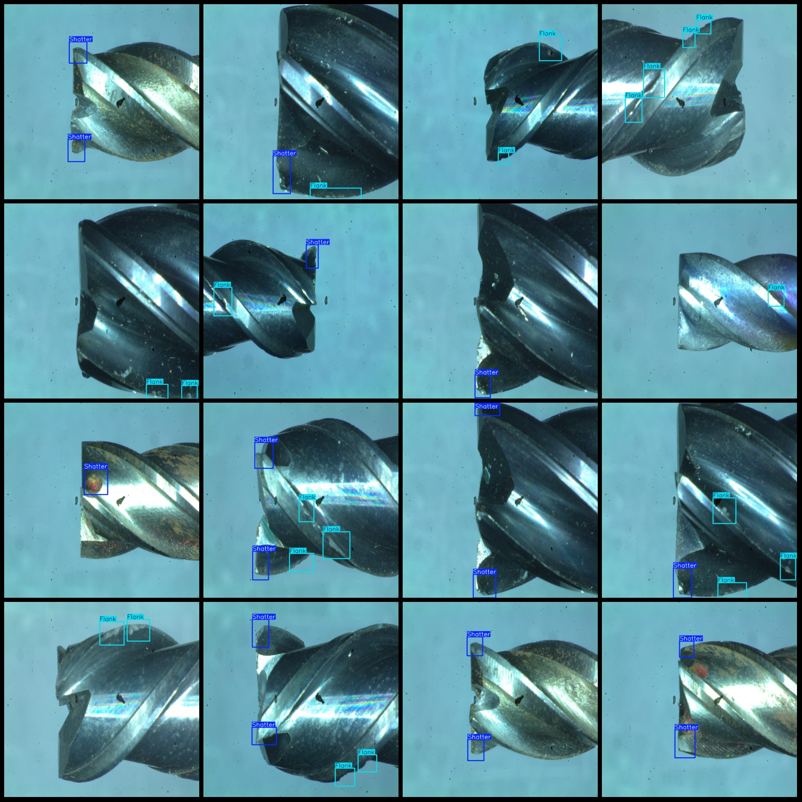
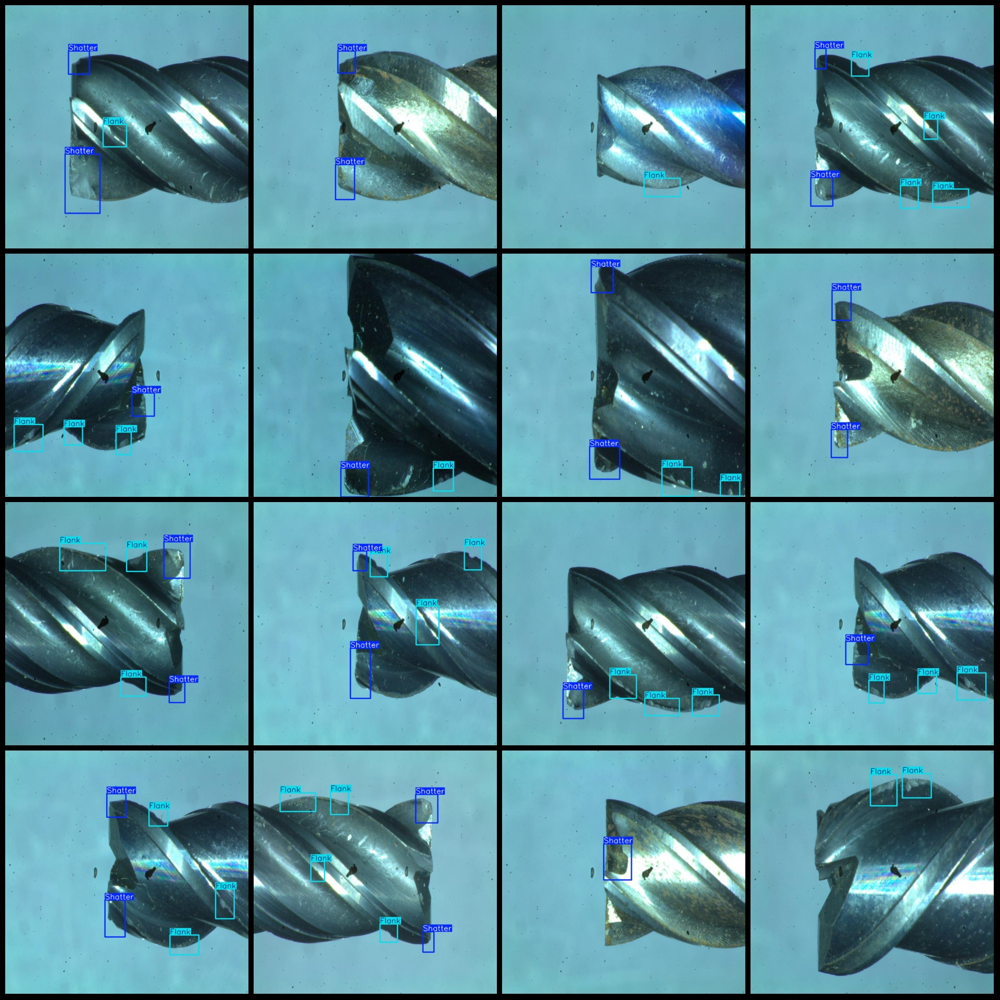

# Micro-milling Tool Wear and Damage Detection Dataset (VOC+YOLO format, 82 images in 2 classes)

Dataset format: Pascal VOC format + YOLO format (txt file without split paths, only containing JPG images along with corresponding VOC format XML files and YOLO format .txt files).

Number of images (JPG file count): 82
Number of annotations (XML file count): 82
Number of annotations (.txt file count): 82
Number of categories: 2
Annotation category names (notice that the order of labels in the YOLO format does not correspond to this, but is based on the labels folder 'classes.txt'): ["cemian_sunshang", "toubu_sunshang"]

Number of bounding boxes per category:
- cemian_sunshang (Side wear/damage): 167
- toubu_sunshang (Head wear/damage): 105
Total bounding boxes: 272

Number of images per category:
- cemian_sunshang (Side wear/damage): 65
- toubu_sunshang (Head wear/damage): 69

Image resolution: 640x640

Annotation tool used: labelImg
Annotation rules: Draw a rectangle box around the category.

Important notice: The dataset does not have been split into training, validation, or test sets; you need to do so yourself.
Special statement: This dataset does not guarantee any accuracy for models trained on it or any weights files.

Image preview:

Annotated example:

## Images

Here is a pay link on Stripe ( https://buy.stripe.com/3cs8yP7sY87d0vu9AB ). Please contact me lonlonago@foxmail.com after funding $89, and I will send you a complete data files , thank you!

